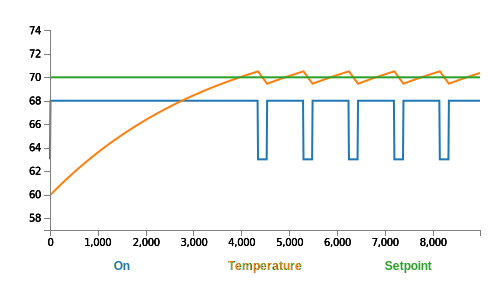

# Building Thermal Model Overview

**Brief:** This section overviews a simple first order discrete thermal model as well as its derivation.

## First Order Model

A first order ordinary differential equation(ODE) is an optimal model for many natural systems which have a "first order" response. Using Laplace notation, this ODE is represented by the following equation:

$$
H(s) = \frac{a}{RC \cdot s+1} $$

In the above equation, $a$ defined the steady-state amplitude of this ODE and $RC$ is the [RC time constant](https://en.wikipedia.org/wiki/RC_time_constant). Discretization of this model allows for simple calculation.

## Forward Difference

The [forward difference](https://en.wikipedia.org/wiki/Finite_difference#Forward,_backward,_and_central_differences) is a simple discretization method which converts from continous time to discrete time. The forward difference is represented in the following equation using Laplace and Z-Transform notation.

$$
s = \frac{z - 1}{\Delta T}
$$

Substituting this into the first order model one arrives at the following: 


<details><summary>See work</summary>

$$
\frac{Y}{U} = \frac{a}{RC \cdot (\frac{z - 1}{\Delta T})+1} 
$$

$$
\frac{Y}{U} = \frac{a \Delta T}{RC(z - 1)+\Delta T} 
$$

$$
Y(RC(z - 1)+\Delta T) = a \Delta T U 
$$

$$
Y \cdot RC \cdot z = a \Delta T U + Y (RC - \Delta T)  
$$

</details>

---


$$
y(k+1) = \frac{a \Delta T \cdot u(k)}{RC} + y(k) (1 - \frac{\Delta T}{RC})  
$$

## Thermal Model

Using the first order model as well as assumptions about the nature of a building, this section demonstrates a simple thermal model. The assumptions for this simple thermal model are as follows: 

- A buildings temperature will coverage to outdoor air temperature(OAT) in the absence of an input
- An HVAC's output steady state will apply a fixed gain $a$ on top of OAT
- An HVAC's dynamic response is first order and defined by an $RC$ time constant  

Using these assumptions, the code for a simple thermal model is as follows:

```js

function thermal_step(u){
    this.delta =  this.gain*this.dt*u/this.time_constant + this.delta*(1 - this.dt/this.time_constant) ;
    this.temperature = this.delta + this.oat;
}


function simple_thermal(obj){
    this.gain = obj.gain;
    this.temperature = obj.temperature;
    this.dt = obj.dt;
    this.oat = obj.oat;
    this.time_constant = obj.time_constant;
    this.step = thermal_step;
    this.delta = this.temperature - this.oat;
}

```

Using this model in conjunction with a controller, one can observe the following: 


<p align='center'>



</p>

The code that was used to generate the above image is located in [here](https://github.com/NateZimmer/piStat/tree/master/test/). A simple deadband controller was used as the controller. 

