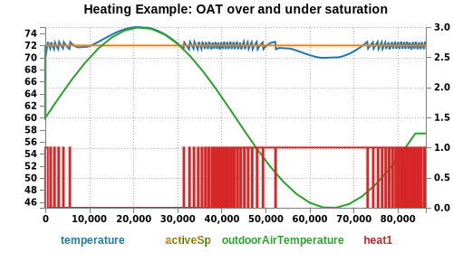

# PI Stat

[](https://travis-ci.com/NateZimmer/piStat) [](https://coveralls.io/github/NateZimmer/piStat?branch=master) [](http://opensource.org/licenses/MIT) 


***An affordable thermostat for engineers by engineers.*** 

PI Stat is a 'cloudless' open source smart thermostat project written in Node JS and offers a powerful data gathering and visualization system. This ecosystem is designed to run on low cost (sub 50 USD) hardware. 


> **Note**: 12/4/22, project was functional for myself though not sufficiently documented. Hardware exists but using the PI is now in question given how hard it is to source.

## Getting Started

1. Obtain undocumented hardware... 
1. Clone this repo to your PI.
2. Dependencies:
    - Node 14
3. Run `install.sh`
4. Edit `my_variables.sh` file that is generated, create unique passwords & run `install.sh` again. 

`install.sh` lastly runs:

```
. ./my_variables.sh && node src/run.js
```

This ultimately runs `node src/run.js` which is the top level script with some environment variables containing sensitive variables

## Testing

PI Stat uses a mock system combined with a thermal model to verify system functionality. The following is an example test output:  



This verifies the business logic while mocking GPIO, temperature, time functions ...etc to run simulated long duration tests. 

```
npm run test
```

## Hardware

For ease of assembly, a basic through-hole PCB was made with easily sourced common hardware. Ironically now, the PI is the un-source-able aspect. 


